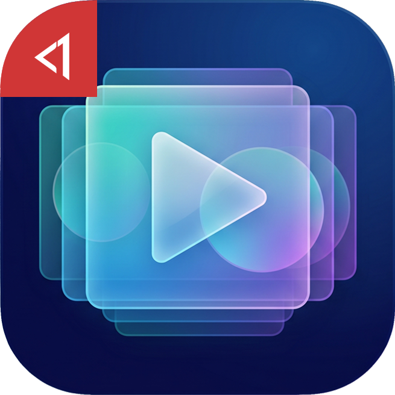
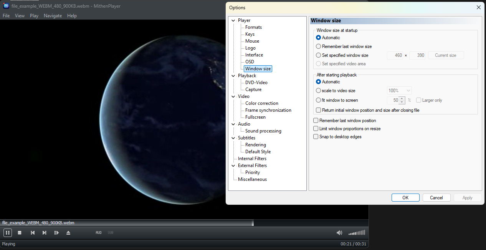

  

<h1 align="center">MithenPlayer</h1>

MithenPlayer is a lightweight media player for Windows, focused on local playback. A Windows focused fork of <a href="https://github.com/Aleksoid1978/MPC-BE">MPC-BE</a>, which is derived from <a href="https://github.com/mpc-hc/mpc-hc">MPC-HC</a> and the original <a href="https://github.com/guliverkli">Media Player Classic</a> by Gabest.

## Additional features in this fork
* Local playback only. Removed the "Online media services" (YouTube, yt-dlp, AceStream, TorrServer) and the web interface.
* Follows Windows explorer sorting for `Next File` / `Previous File`.
* Simplified window sizing: `Automatic` at startup (50% of the current screen, DPI-aware) and `Automatic` after playback (scale to video size, maximize when the video is larger than the screen).
* Streamlined default hotkeys:
  * `Esc` exits, `Alt + Enter` / `F` / `F11` toggle fullscreen
  * `I` shows properties, `Ctrl + S` toggles subtitles
  * `+` / `-` adjust volume like `Up` / `Down`, `Ctrl + +` / `Ctrl + -` adjust audio delay
  * `Ctrl + 0` maximizes, `Ctrl + .` uses original video size (maximize if larger), `Ctrl + 1` / `Ctrl + 2` / `Ctrl + 3` set 1x / 2x / 3x
* Removed favorites, "recently opened" tracking, the update checker, and their related settings.
* Removed the language menu. Language is selected only during installation.
* Removed the "Translations" component; the installer installs only the selected language.
* Uninstalls cleanly, no leftovers.
## Screenshot

## Supported platforms
* Windows 7, 8, 8.1, 10, 11 (x64). You may need to install the [Visual C++ runtime](https://aka.ms/vs/17/release/vc_redist.x64.exe) if you don't have it already.
## Part of MithenApps
* No telemetry
* No changing language after installation (lighter)
* No lingering background service. Closed when it's closed.
* No tracking of what "recent" files you opened. (lighter, privacy reasons)
* No update checking (use it as a tool, update it when you find issues only)
* Uninstalls cleanly, no leftovers
* Prioritizing user-ergonomics
## Credits
* [Gabest](https://github.com/guliverkli) - original author of Media Player Classic.
* [casimir666](https://github.com/mpc-hc/mpc-hc) - author of Media Player Classic - Home Cinema (MPC-HC).
* [Aleksoid1978](https://github.com/Aleksoid1978) - maintainer of [MPC-BE](https://github.com/Aleksoid1978/MPC-BE), which MithenPlayer is based on.
